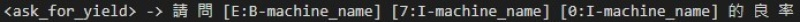

# JointBERT_chinese

(Unofficial) Pytorch implementation of `JointBERT`: [BERT for Joint Intent Classification and Slot Filling](https://arxiv.org/abs/1902.10909)

## Model Architecture

<p float="left" align="center">
      
</p>

- Predict `intent` and `slot` at the same time from **one BERT model** (=Joint model)
- total_loss = intent_loss + coef \* slot_loss (Change coef with `--slot_loss_coef` option)
- **If you want to use CRF layer, give `--use_crf` option**

## Dependencies

- python>=3.6
- torch==1.6.0
- transformers==3.0.2
- seqeval==0.0.12
- pytorch-crf==0.7.2

## Dataset

- Edit files inside data/UMC/ and label as IOB format.

- intent_label.txt        : pre-defined intents are listed here.
- slot_label.txt          : pre-defined slot are listed here.
- train/ , dev/ , test/   : labeled datasets.

- Each character has own slot value,
e.g., A50 -> B-machine_name I-machine_name I-machine_name

There are some examples in  train/ , dev/ , test/

- If you modify your datasets, remember to delete the cache files.
## Training & Evaluation

```bash
$ python3 main.py --task {task_name} \
                  --model_type {model_type} \
                  --model_dir {model_dir_name} \
                  --do_train --do_eval \
                  --use_crf


# For UMC
$ python3 main.py --task UMC \
                  --model_type bert \
                  --model_dir UMC_model \
                  --do_train --do_eval
```


## Prediction

```bash
$ python3 predict.py --input_file {INPUT_FILE_PATH} \
                     --output_file {OUTPUT_FILE_PATH} \
                     --model_dir {SAVED_CKPT_PATH}
```

output example:



## References

- [JointBERT](https://github.com/monologg/JointBERT)
- [Huggingface Transformers](https://github.com/huggingface/transformers)
- [pytorch-crf](https://github.com/kmkurn/pytorch-crf)
